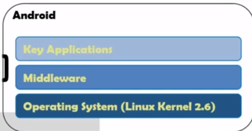
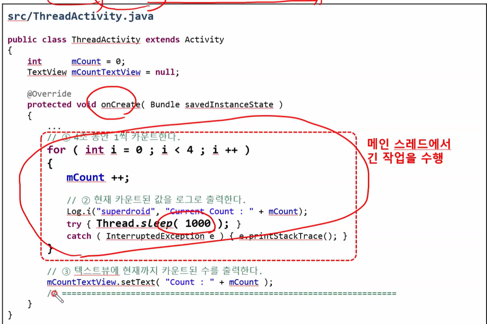

# 중간 - 모바일프로그래밍

복습: No
유형: 전공
작성일시: 2021년 9월 3일 오후 6:21

## 21.09.01

단순히 앱을 개발한다는 취지가 아니라, 안드로이드 시스템에 대해 공부할 것임.

시험 대면으로 보면 과제를 어렵게 할 거지만, 보통 1~3일안에 할 수 있는 과제를 낼 거임.

---

### Evolution of Cell Phones

1. 1983 DynaTAC
2. 1989 MicroTac
3. 1996 StarTac
4. 2005 Razor V3

---

### Personal Digital Assistants

- Typewriting
- Address Book
- Calendar
- Picture
- Book

---

### Smart Phone = PDA + Cell Phones

---

### 스마트폰의 역사

- 1992 IBM사의 사이먼
- 1996 노키아 9000
- 2002 마이크로소프트 포켓PC
- 2007 아이폰
- 2008 안드로이드 폰
- 2010 윈도폰7, 웨이브

---

### 스마트폰 운영체제 점유율

안드로이드 75%

IOS 25%

---

### 안드로이드의 주요 기능

안드로이드의 주요 기능

- 애플리케이션 프레임워크가 제공하는 API를 사용 → 코드를 재사용하여 효율적이고 빠른 애플리케이션 개발 가능
- 모바일 기기에 최적화된 달빅 또는 아트
- 2D 그래픽 및 3차원 그래픽을 최적화하여 표현
- 모바일용 데이터베이스인 SQLite를 제공
- 각종 오디오, 비디오 및 이미지 형식을 지원
- 각종 하드웨어(블루투스, 카메라, 나침반, WIFI 등) 지원
- Android Studio를 통해 강력하고 빠른 개발환경 제공 → 단점 : 새롭게 업그레이드 될 때 불안정함. 기존 버전에서 개발한 앱이 빌드 안될 수 있음.

초창기 안드로이드 무겁고 느리고 그랬는데, JVM 안드로이드 CPU로 바꿔서 실행하다보니 과부하가 증가.

자바를 생성하면 Object를 만듦. JVM 가비지 컬렉션 동작 때문에 성능이 저하됨. 하지만 지금은 관련없음.

---

### 안드로이드의 특징

- 안드로이드의 핵심 커널은 리눅스로 구성
- 안드로이드 애플리케이션 개발 언어는 Java를 사용
- 안드로이드 SDK에서 많은 라이브러리를 포함하고 있어 개발이 용이
- 오픈 소스를 지향하기 때문에 운영체제부터 관련 문서, 개발 도구 등 거의 모든 것을 무료로 사용 가능
- 지속적인 업그레이드를 제공
    - 장점 : 기능, 보안 업그레이드
    - 단점 : 기존 API 삭제 또는 동작 안됨 → 기존 개발된 앱 실행(X), 개발자 고통

---

### 안드로이드의 구조

MiddleWare : 어플에게 API를 제공함

OS : MiddleWare에게 시스템 콜을 제공함.

자바 API를 호출하면 거기에 대응하는 C/C++ 코드가 호출됨. NATIVE LAYER

JNI - JAVA NATIVE INTERFACE : LIBRARIES NATIVE + ANDROID RUNTIME

---

응용프로그램(Applications)

- 안드로이드 스마트폰에서 사용할 수 있는 일반적인 응용 프로그램
- 웹 브라우저, 달력 구글맵, 연락처, 게임 등등
- Java 또는 Kotlin로 제작
- 예를 들어 구글 플레이스토어에서 받은 어플리케이션

응용프로그램 프레임워크(Application Framework)

- 안드로이드 API가 존재하는 곳
- Java와 Kotlin 기반의 API 제공
- 앱을 효율적이며 쉽게 개발할 수 있도록 하기 위함

---

안드로이드 런타밈(Anroid Runtime) - JVM 역할을 한다. 자바 기반의 opcode를 CPU 명령어로 바꿔준다.

- Java 코어 라이브러리와 달빅 가상머신 또는 아트 런타임으로 구성
- 자바 기반의 명령어를 CPU 명령어로 변환하여 실행함

라이브러리(Libraries)

- 안드로이드에서 사용되는 여러 시스템 라이브러리는 시스템 접근 때문에 Java가 아닌 C/C++로 작성. 주로 C++
- 안드로이드 라이브러리 종류
    - 오디오, 비디오 재생을 위한 미디어 자원
    - 데이터베이스 자원을 위한 SQLite
    - 3D 그래픽을 위한 OpenGL
    - 등등

리눅스 커널(Linux Kernel)

- 하드웨어의 운영과 관련된 저수준의 관리 기능들이 들어 있음.
- 주로 메모리 관리, 디바이스 드라이버 보안 등

---

### 안드로이드 앱의 실행 파일

안드로이드 실행 파일은 전통적인 실행 파일과 다름

전통적 실행 파일(.exe, a.out)

- 실행 파일에는 프로그램을 구성하는 코드와 데이터(전역변수 등)가 들어 있음.
- 실행 파일이 메모리상으로 올라와 실행을 시작하면 프로세스가 됨.
- 실행 파일과 프로세스가 1:1로 대응되며 응용 프로그램끼리는 서로 독립적임.

안드로이드 응용 프로그램(.apk)

- 실행 파일은 같은 패키지에 속한 자바 클래스와 리소스(이미지, UI구성, 정보 등)의 집합.
- 응용 프로그램끼리 서로의 기능을 공유할 수 있음.
- 다른 프로그램의 구성 요소를 불러와 자신의 주소 공간에서 실행 가능.

---

### 안드로이드의 앱 구성

안드로이드의 응용 프로그램

- 안드로이드 응용 프로그램은 4개의 컴포넌트로 구성된다.

4대 컴포넌트(중요)

- Activity : 전체 화면 들을 액티비티라고 함.
    - 사용자 인터페이스를 구성하는 기본 단위
    - 눈에 보이는 화면 하나가 액티비티이며 여러 개의 뷰(위젯)들로 구성된다.
    - 응용 프로그램은 필요한 만큼의 액티비티를 가질 수 있으며, 그 중 어떤 것을 먼저 띄울지 지정.
- Service
    - UI가 없어 사용자 눈에 직접적으로 보이지 않으며 백그라운드에서 무한히 실행되는 컴포넌트
    - 미디어 플레이어를 들 수 있는데 비활성화된 상태라도 노래는 계속 재생
    - UI가 없으므로 사용자의 명령을 받아들일 수 있는 액티비티와 연결해서 사용된다.
- Broadcast Receiver : **일종의 이벤트 전달 수단**
    - 시스템 또는 앱으로부터 전달되는 방송을 대기하고 신호 전달시 수신하는 역할을 한다.
    - 예를 들어 배터리가 떨어졌다거나, 전화가 왔다던가, 네트워크 전송이 완료되었다 등의 신호를 받는다.
    - 신호만 대기할 뿐 UI를 따로 가지지는 않으므로 방송 수신 시 방송의 의미를 해석하고 적절한 액티비티를 띄우는 역할.
    - 이벤트 - Broadcast / 이벤트 헨들러 - Broadcast Receiver
- Content Provider
    - 다른 응용 프로그램을 위해 자신의 데이터를 제공한다.
    - 안드로이드는 보안이 엄격하여 다른 응용 프로그램의 데이터를 함부로 엑세스 하지 못하도록 되어 있다.
    - 응용 프로그램 간에 데이터를 공유할 수 있는 합법적인 유일한 장치가 바로 콘텐트 제공자이다.

응용 프로그램은 액티비티, 서비스, 방송 수신자, 콘텐트 제공자 중 일부만을 가질 수도 있고 여러 개를 가질 수도 있다.

---

### 개발 운영체제

안드로이드 개발을 위한 운영체제

- Windows, Linux, Mac이 있음.
- Windows 개발환경이 가장 보편적
- 안드로이드 개발 환경을 구축하면 가상의 안드로이드 장치인 AVD(Android Virtual Device) 제공
- 실제 안드로이드 장비 없이도 안드로이드 장비가 있는 것처럼 작업 가능

---

### 안드로이드 개발 환경

---

### 안드로이드 개발 환경 구축

---

## 2주차 21.09.09

### Create Project

App Name : 앱 상에 사용자에게 보여주는 이름. 영문만 가능

Project Name : 개발자가 프로젝트를 구별하기 위함.

지금은 ProjectName이 APP Name과 통합되어버렸다.

---

### Package Name

Package Name은 안드로이드 시스템(사용자가 아닌)이 서로 다른 앱을 구분할 수 있도록 하기 위함.

test ← 이게 앱 이름임.

MainActivity는 Java 파일이다.

앱 이름은 같아도 되는데 패키지 이름까지 같으면 설치가 불가능하다.

패키지 이름이 같은 앱은 등록할 수가 없음.

---

### 프로젝트 기본 정보의 세 가지 이름 정리

앱 이름을 계산기로 만들고 싶다면, `AndroidManifest.xml` 파일의 label을 수정하면 어플리케이션의 이름을 수정할 수 있다.

---

### 안드로이드 프로젝트 구성 요소

---

### `AndroidManifest.xml`

안드로이드 시스템에 애플리케이션에 대한 필수적인 정보를 제공해주는 역할을 한다.

애플리케이션 컴포넌트

- 액티비티
- 브로드캐스트
- 리시버
- 컨텐트 프로바이더

이것들을 `.xml` 파일에 등록해야함.

### Version

### 액티비티 소스

xml 파일 안에 Java 소스 정보 들어감.

프로젝트 생성하면 `onCreate()` 메소드 또한 생성됨.

onCreate는 액티비티의 Entry Point이다.

`setContentView()` 안에는 인자로 리소스 파일을 지정

EX) `setContentView(R.layout.activity_main);`

 

### 리소스명

### 화면 리소스 XML

`.xml` 형태로 하게 될 것.

---

레이아웃 XML을 작성하면 자동으로 리소스 ID 생성됨.

액티비티에서 레이아웃 사용하면 됨.

### 안드로이드 앱 컴파일 과정

---

## 2주차 21.09.10

# 4. 레이아웃 구성요소 뷰와 뷰그룹

### 뷰에 대해서

뷰 == 위젯

---

### 뷰그룹

<aside>
💡 뷰 그룹은 여러 자식 뷰를 담을 수 있으며,  뷰는 반드시 뷰그룹에 포함되어야지만 화면에 그려진다.

</aside>

- LinearLayout
- RelativeLayout
- TableLayout
- FrameLayout

---

### 뷰의 배치 정보를 활용

- 화면 배치 정보 LayoutParams
- 뷰가 가지는 다양한 LayoutParams 정보
- 최상위 뷰그룹의 LayoutParams 정보
- 뷰그룹의 파생된 클래스와 LayoutParams 정보

### 화면 배치 정보

LinearLayout은 기본적으로 Vertical

### 최상위 뷰그룹의 LayoutParams 정보

결국 모든 종류의 뷰그룹은 최상위 ViewGroup 클래스에서 파생 클래스로 정의된다.

즉, LayoutParams, MarginLayoutParams를 상속받는다.

### 뷰그룹의 파생된 크래스와 LayoutParams 정보

### activity_main.xml

부모와 동일하게 설정하겠다.

`match_parent` 

뷰 스스로 적당한 크기에 맞춘다(**일반적으로 문자열의 크기에 맞춰진다**)

`wrap_content`

### 레이아웃의 유연성 속성

match_parent 값은 부모 뷰그룹에 크기를 맞추기 때문에 화면 크기가 다른 단말에서도 유연하게 레이아웃을 유지할 수 있다.

---

# 5. 대표적인 뷰그룹에 대해서

### LinearLayout

<aside>
💡 자식 뷰들을 수평 혹은 수직으로 배치하는 뷰그룹

</aside>

---

**Orientation 속성**

- Vertical : 수직 배치
- Horizontal : 수평 배치

---

**Gravitiy 속성** : LinearLayout 내에서 자식뷰들이 배치 위치(중력 방향)를 지정함.

top | left 가 디폴트 값이다.

- top : 상단에 배치
- bottom : 하단에 배치
- left : 좌측에 배치
- right : 우측에 배치
- center_vertical : 수직 중앙에 배치
- center_horizontal : 수평 중앙에 배치
- center : 정 중앙에 배치

---

**baselineAligend 속성** : 텍스트가 포함된 자식 뷰 중 가장 높이가 긴 뷰를 기준으로 정렬할 지 설정함.

- True
- False

---

**baselineAlignedChildIndex 속성** : 뷰그룹안에 뷰그룹이 존재할 때 View3의 문자열을 어디에 맞출 지 정해주는 옵션. 제일 첫번째 뷰부터 0번이 된다.

---

**Layout의 Gravity가 아닌 각 View의 Gravity 속성**

Layout gravity가 right라서 오른쪽에 배치

순서대로 bottom, center_vertical, top이기 떄문에 다음과 같이 배치.

---

layout_weight 속성 : 자식 뷰에 가중치를 지정해서 그 크기를 결정함.

**layout_width = 0dp 또는 wrap_content로 설정해야함.**

### 레이아웃의 유연성 속성

LinearLayout LayoutParmas의 layout_weight 속성은 특정 자식뷰의 크기를 가변적으로 조절할 수 있기 때문에 다양한 화면 크기의 단말에서 유연하게 레이아웃을 유지할 수 있다.

---

layout_weight 속성과 LinearLayout의 measureWithLargestChild 속성

measureWithLargestChild 속성이 True이면 레이아웃 내 layout_weight를 가지는 모든 자식 뷰를 가장 큰 자식 뷰의 크기로 조정됨.

이때, layout_weight는 0 이상의 임의의 값도 가능함.

## 3주차 21.09.15

### RelativeLayout

각 뷰들의 관계에 따라 배치하는 방법

---

**gravity 속성과 ignoreGravity 속성**

---

**이밖의 여러가지 속성들**

다음과 같은 특성을 true로 설정하면 됨.

### 자식 뷰 간의 관계 배치 속성들

---

### 자식 뷰 배치 예시

---

### 레이아웃의 유연성 속성

**매우 빈번히 사용되므로 기억할 것**

이렇게 만들게 되면 View2는

View1의 오른쪽 + View3의 왼족에 배치되게 된다.

---

### FrameLayout

겹쳐서 배치하는 것.

---

**foreground와 foregroundGravity 속성**

이미지 하나 올리는데, 이것을 right|bottom 설정.

---

**measureAllChildren 속성**

디폴트 : Visible

Visible : 보이는 상태

Invisible : 보이지 않으나 FrameLayout 영역을 차지하고 있음.

Gone : 보이지 않고, FrameLayout 영역을 차지하지 않음.

measureAllChildren = true 이면 gone을 invisible처럼 적용.

---

**layout_gravity 속성**

---

### TableLayout(많이 사용함)

---

TableLayout과 TableRow는 LinearLayout을 상속받은 것이다.

---

**collapseColums 속성**

해당 열을 숨김.

---

**shrinkColumns 속성**

지정한 열의 공간을 줄이고 나머지 공간을 확보함.

---

**stretchColumns 속성**

공간이 남을 때 특정 열이 늘어나서 공간을 채우라는 의미.

---

**layout_colums 속성**

자식 뷰의 시작 열을 지정한다.

---

**layout_span 속성**

하나의 뷰가 하나 이상의 열을 차지하게 만듦.

---

## 대표적인 뷰

- 뷰의 파생 클래스
- 최상위 뷰 속성 - id
- 최상위 뷰 속성 - background
- 최상위 뷰 속성 - padding
- 최상위 뷰 속성 - visibility

---

---

### 최상위 뷰 속성 - id

`findViewById()` 함수를 사용하여 해당 뷰를 참조할 수 있다.

---

### 최상위 뷰 속성 - background

`@drawable` 폴더 안에 이미지 저장해서 이미지 지정 가능.

---

### 최상위 뷰 속성 - padding

---

### TextView

---

**textColor 속성**

**이외에 글꼴에 관련된 속성들**

---

---

**singleLine 속성**

singleLine 속성을 True로 하면 `닳..` 이런식으로 나오게 된다.

**ellipsize 속성 (중요한 게 아니라고 하심)**

**ellipsize 속성과 marquee와 marqueeRepeatLimit 속성 (집에서 해보라고 하심 중요하지 않음)**

**gravity 속성**

**lines, minLines, maxLines 속성**

lines : 라인을 고정으로 픽스

minLines : 최소 라인 수(글자가 적어도 지정한 라인을 디폴트로 표시)

maxLines : 최대 라인 수(설정한 라인 이하로 변경될 수 있음)

**lineSpacingExtra, lineSpacingMultiplier 속성**

줄간격 관련 속성

## EditText - TextView를 상속받음.

**editable, enabled 속성**

editable을 false로 설정하면 검은색 글자로 뜨며 입력하고 수정할 수 없음.

enabled를 false로 설정하면 회색 글자로 뜨며 입력 불가하게 만듦.

**digits 속성**

원하는 글자만 선택적으로 입력받을 수 있음.

**hint, textColorHint 속성**

hint : EditText 배경에 특정 문자열 표시

textColorHint : hint 문자열 색상 변경.

**selectAllOnFocus, textColorHighlight 속성**

글자 전체가 포커스 됨.

포커스 컬러도 설정해줄 수 있음.

**inputType 속성 (중요함)**

**Button**

**버튼의 콜백함수 명을 onClick에 등록 가능**

Toast 화면 상에 한번 올라왔다가 사라지는 것.

**교수님 : 콜백함수 부분 알아둘 필요가 있음!**

### ImageView 간단하게 설명하고 넘어갈 것.

drawable 폴더, mipmap 폴더에 넣어주면 됨.

 **src 속성**

이미지의 주소값 입력

이미지는 그냥 넘어갈 거에요. 여러분들이 잘 읽어보세요

이미지 배치 어떻게 하는지 비율 유지 어떻게 하는지 한번 보세요.

## 이벤트

### 터치 이벤트

제어 흐름이 결정되어 동작을 처리하는 것.

터치 이벤트

- Down
- Move
- Up

### 터치 이벤트 전달 과정

### 터치 이벤트 수신 함수

액티비티 안에 뷰그룹이 있고,

뷰그룹 안에 뷰가 있음.

터치 이벤트는 액티비티를 통해 최초 전달

`dispatchTouchEvent()` 함수와 `onTouchEvent()` 함수를 오버라이드 하여 사용함.

---

## 4주차 21.09.22

### 터치 이벤트 수신 함수

`onTouchEvent()` 는 뷰 → 뷰그룹 → 액티비티 순으로 소비된다.

### 터치 이벤트 수신 함수의 역할

### 터치 이벤트 리스너

View를 상속 받아서 onTouchEvent를 오버라이딩 해야하는데 이것은 불편하고 번거롭다.

### 터치 이벤트 리스너란?

만약 OnTouchListener 인터페이스가 구현이 되어 있다면, onTouchEvent 함수를 호출하기 앞서

인터페이스 내에 onTouch 함수를 실행시킴.

제일 처음 실행되는 것이 `onCreate()` 

1. id값으로 button 객체 얻어옴
2. 터치 이벤트 리스너를 설정하고, 객체를 생성한다.
3. 클래스로 View.OnTouchListener를 구현한다.
4. onTouch 내에서 event.getAction() 으로 터치 이벤트 액션 정보를 얻어올 수 있음.
    - ACTION_DOWN : 0
    - ACTION_UP : 1
    - ACTION_MOVE : 2
5. onTouchEvent() 이벤트를 호출하기 위해서 return 값을 false로 설정.
6. onTouch에선 무조건 false로 리턴을 해야한다.

액티비티에 바로 View.OnTouchListener를 상속받아 바로 구현하는 법

1. onTouch를 바로 오버라이드 해준다.
2. setOnTouchListener(this)에서 this를 해줘도 문제가 안되는 것이, 터치 리스너를 상속받기 때문이다.

View.OnTouchListener() 객체 자체를 익명 클래스를 만들어서 onTouch 재정의.

### 익명 클래스

### 터치 이벤트 확장 - 클릭 리스너

단순히 클릭했을 때 이벤트를 발생시키고 싶다면 onClickListener를 사용하면 된다.

특이한 부분은 switch 문에 v.getId()를 하게 되면 id 값을 가져온다.

### 더 편리한 클릭 리스너

onClick 속성에 메소드를 등록하면 됨.

이렇게 하면 상속받을 필요 없다.

clickable : 클릭 리스너의 호출 여부, 기본 true임.

onClick 속성을 사용할 때는 clickable 속성 필요 없음.

### 한 개의 클릭 핸들러를 사용하여 다중 버튼의 클릭을 처리하는 방법

버튼 id에 따라서 case 문을 다르게 처리하면 됨.

### 터치 이벤트 확장 - 롱클릭 리스너

버튼을 0.5초 이상 누르고 있을 때, 쓰는 리스너

구현하는 방법은 다음과 같다.

사실상 버튼이 하나밖에 없다면 switch 문이 필요가 없다.

---

### 키 이벤트란?

포커스 : 키 이벤트를 전달받을 수 있음을 나타내는 시각적인 표시.

focusable 속성이 false 이면 포커스를 받을 수 있지만, 키 이벤트가 오지 않는다.

대부분의 뷰들은 focusable 속성이 true이다.

**키 누르면 포커스 되는 예제 그냥 넘어가심**

### onBackPressed 재정의 함수

뒤로가기 키를 눌렀을 때 앱이 종료되거나, 액티비티가 종료되는데 이것을 onBackPressed를 재정의 할 수 있음.

**onBackPressed 재정의 함수는 액티비티만 지원한다.**

### 키 이벤트 리스너

키를 눌렀을 때 키에 대한 정교한 동작을 실행하고 싶을 때

OnKeyListener 상속 받아서 onKey 구현

ACTION_DOWN 인지,

KEYCODE_B인지

isLongPress()인지

조건문으로 구별 가능.

이벤트를 처리하고 나면 true값을 리턴.

아니라면 false를 리턴.

### Dimension 리소스 - 길이, 치수

px : 화면이나 이미지를 구성하는 하나의 점 단위

dp : 해상도와 관련한 밀도 독립 픽셀 단위

sp : 글자 크기와 관련한 밀도독립 픽셀 단위

in : 물리적 단위 2.54 센티미터를 1인치라고 함. 일반적인 길이 단위

pt : 물리적 단위 화면 1/72 인치를 1포인트라고 함. 인쇄 관련 단위

mm : 물리적 단위 1 센티미터는 10밀리미터. 일반적인 길이의 단위

### 픽셀

픽셀은 웬만하면 사용해서는 안됨.

### in, pt, mm

물리적 단위도 웬만해서 사용해서는 안 된다.

### dp

- dp는 밀도독립 픽셀 단위이다.
- dp는 화면 밀도 또는 해상도에 따라 각자의 픽셀 수를 달리하는 단위이다.
- 화면 밀도 또는 해상도에 의존하지 않는다.

픽셀에 대해서 유연하다.

### dp의 단위

1인치 160개의 픽셀이 배치되는 단말기 환경을 기준 밀도로 둔다.

320dip가 무너져 버림.

유연한 레이아웃을 생성하는 것이 중요하다.

---

### sp

글자의 크기. 10sp = 10dip 동일하다. 글의 대각선 길이.

### Drawable 리소스

비트맵 파일 리소스 사용하기

### 액티비티 실행과 인텐트

4대 컴포넌트 중에 아주 중요한 액티비티에 대해서 배움.

화면 전체가 액티비티임.

맨 밑에 네모처럼 액티비티를 등록시켜줘야함.

새로운 프로젝트로 A앱을 만든다.

### 인텐트란? 컴포넌트 간에 통신을 위해 주고 받는 메세지 또는 데이터 덩어리.

1. 인텐트를 생성
2. 액티비티 정보(패키지 이름, 액티비티 이름)을 설정
3. intent.setComponent로 설정해 줌.
4. startActivity(intent)로 B액티비티를 실행함.

액티비티 이름을 넣거나 클래스 이름을 넣어도 무방하다.

### 과제 1번

각각에 대해서 xml 파일을 만들어야 함.

터치에 대한 스켈레톤 코드를 줄 것임.

이번 과제는 `.xml` 파일만 잘 구현하면 됨.

확인, 취소는TextView

나머지는 EditText

유의사항

1. project 파일 압축
2. apk 파일 제공

---

## 5주차 21.09.29

### 인텐트, 패키지 매니저, 액티비티 매니저

패키지 매니저 : 앱을 설치하고 삭제하며, 설치된 모든 패키지 정보를 수집

액티비티 매니저 : 안드로이드의 4대 컴포넌트들을 관리하며, 그 중 액티비티를 실행하는 기능도 가진다.

인텐트 : 앱과 통신할 수 있는 데이터 덩어리. (실행할 액티비티 정보)

### 실행될 액티비티에게 데이터 전달하기

첫번째 인자는 전달하고자 하는 데이터 이름 Key 값

두번째 인자는 전달하고자 하는 데이터 Value 값

B액티비티에서 받아서 출력 가능.

서로 다른 프로세스는 서로의 메모리를 절대 참조할 수 없음.

안드로이드에서 하나의 패키지가 실행되면 하나의 프로세스가 생성되며, 패키지의 모든 처리는 생성된 프로세스에서 돌아간다.

안드로이드에서는 IPC를 위해 Binder 제공.

통신 성능이 좋음. 리눅스 내부에서 커널 메모리에 있는 Shared Memory로 사용됨.

**핵심 : 서로 다른 두 앱은 Binder IPC를 통해서 데이터를 주고 받는다**

### 프로세스 간 데이터 전달

바인더(Binder)? : IPC 프로토콜

직렬화? : 여러 데이터를 메모리;에 직렬로 할당하는 동작.

데이터 타입의 종류가 다양하다.

**Parcel, Pacelable은 대충 설명하고 넘어갈게요 앱 개발할 때 사용되지 않아요**

### 데이터 덩어리 인텐트

**데이터를 직렬화해서 보내게 된다.**

Primitive 타입 : 가공되지 않은 순수 자료형

- boolean
- byte
- char
- short
- int
- long
- float
- String

프리미티브 타입의 변수를 클래스 내에 정의하고 객체화한다.

그런데 이렇게 보내면 데이터가 직렬화되지가 않음. 그렇기 때문에 Serializable 인터페이스를 사용해야함.

### 자바의  Serializable 인터페이스를 상속받은 직렬화 객체

데이터 직렬화를 위해 버전을 넣어줌.

Serializable 인터페이스를 그냥 알리는 용도일 뿐.

Serializable이 정의된 클래스를 동일하게 넣어줘야함.

### 발신자 쪽 AActivity

인텐트에 Serializable로 객체를 전달.

### 수신자 쪽  BActivity

객체를 받음. 전달 받은 직렬화 객체 내용을 출력.

### Serializable 활용

데이터를 주고받을 떄 효율적으로 하기 위해서 직렬화를 사용함.

- 파일로 저장
- 네트워크 이용해 서버 전송

### Parcel

 Serializble보다 조금 더 진화된 형태의 직렬화 매커니즘이다.

성능이 더 좋아지는 장점이 있지만 사용하기 불편하다. **그래서 넘어간다**

### Bundle

- 번들은 클래스 파일 자체를 배포할 필요가 없다!
- 번들 클래스 자체로 통신하기 때문에.
- 번들은  Map과 같은 형식으로 사용된다. Key-Value 형태

### 번들 예제 : 송수신측에 번들 클래스를 넣어줄 필요가 없이 그냥 생성하면 됨.

발신자 측

수신자 측

인텐트를 받아서 번들을 받음.

### 인텐트

**저 변수들 + Component의 정보 = Intent**

인텐트 안에 이런 맴버 변수들이 존재함.

직렬화해서 다른 프로세스나 앱으로 전달됨.

`private Bundle mExtras` : 인텐트도 Bundle과 같이 각종 직렬화 객체를 포함시킬 수 있다. 바로 내부에 mExtras Bundle 객체가 있기 때문이다.

### 인텐트에 의미를 부여하는 여섯 가지 정보

**인텐트의 주 목적은 특정 컴포넌트에 대한 실행 정보를 넣어서 해당 컴포넌트를 실행하고, 실행되는 컴포넌트에 원하는 데이터를 전달하는 것이다.**

### 인텐트

### 명시적 인텐트

pakage name과 activity name을 명시적으로 기술하고 인텐트에 컴포넌트 등록.

**A 앱이 외부 B앱을 실행할 때 명시적 인텐트를 사용하는 경우가 거의 없다.**

1. 외부 패키지는 정확한 패키지명과 컴포넌트 명을 미리 알고 있는 경우가 드물다.
2. 알고 있더라도 해당 단말기에 실행될 앱이 설치되어 있지 않을 수도 있다.
3. 외부 앱들도 보안상 자신의 액티비티를 외부에 공개하지 않는다.

따라서 명시적 인텐트는 **패키지 내부(하나의 앱 내부)의 다른 액티비티를 실행할 때**만 사용하는 것이 맞다. **외부 패키지의 액티비티는 암시적 인텐트를 사용**해야한다.

### 예시 : A app앱(패키지)에 A1, A2 액티비티를 추가한다.

`.xml` 에 등록해줘야함. application 태그 안에 activity 태그

패키지 네임 name에 생략 가능.

### A1 액티비티에서 A2 액티비티 실행 (명시적)

- 첫번째 인자 this : package 객체 자기자신
- 두번째 인자 class 이름.

두번째 방법이 더 좋다.

### 액티비티 컴포넌트의 공개 비공개

**exported 속성**

- true 하면 외부에 공개 가능
- false 하면 외부에 공개 불가

암시적인 방법은 디폴트 값이 true로 되어 있다. 왜냐하면 암시적 컴포넌트의 경우 외부에 공개 목적으로 등록된 컴포넌트이기 때문이다.

### 암시적 인텐트

이렇게 외부앱 뭐 쓸지 물어보는 것이 암시적 인텐트.

어떤 의도만으로 원하는 컴포넌트를 실행할 수 있기 때문이다.

A앱이 있는데 브라우저가 없어서 다른 웹 브라우저를 통해서 위 기능을 활용할 것임.

## 6주차 21.10.06

### 의도 정보는 인텐트의 네 가지 정보를 통해 설정

1. 액션 : SMS 발송, 메일을 보낸다 등의 동작을 나타냄
2. 카테고리 : 액티비티의 분류를 나타냄. 
3. 데이터 위치 : 액션이 음악을 재생한다면 데이터는 음악 파일의 경로가 될 수 있음.
4. 데이터 타입 : mp3, wav, mov 등등 타입 지정

### 액션과 카테고리를 이용하여 외부 계산기 컴포넌트를 실행해보자

1. 인텐트 하나 생성
2. 액션 설정 ACTION_MAIN : 앱을 실행할 때 가장 첫번쨰로 실행하는 액티비티를 보여달라는 동작.
3. 카테고리가 계산기인 앱을 실행해달라는 것.
4. 액티비티 실행을 요청함.

### 액션과 데이터 위치

액션과 데이터 위치를 이용해 암시적 인텐트 유청하는 것.

ACTION_VEIW : 무엇을 보여달라는 액션.

네이버 URI를 보여달라는 액션.

---

### 암시적 인텐트

- ACTION_MAIN : 모든 앱들이 다 나옴.
- ACTION_MAIN에서 BROWSABLE 카테고리 넣으면, 브라우저 카테고리인 앱만 나옴.
- ACTION_MAIN에서 CALCULATAOR 카테고리 넣으면, 계산기 앱만 나옴.

### 액션과 데이터 위치 및 타입

버추얼 디바이스에 파일을 넣을 수 있음.

### 액션과 데이터 위치에 대한 명세 방법

URI 클래스를 제공

### 안드로이드는 MIME 데이터 타입을 사용함.

EX) 앞쪽 Type 뒤는 Sub Type

안드로이드는 MIME 형식의 규정을 따르고 있음.

---

### SDCARD에 MP3 파일을 넣음

**데이터 타입을 따로 분리하면 안됨. 같이 써야함.**

### 데이터 위치 전달의 필요성

데이터 위치를 사용해야하는 이유

1. 이미지 데이터 용량이 크고 다른 앱 프로세스에게 전달하려면 직렬화 객체를 사용해야함. 직렬화 번거롭기 때문에.
2. 이미지 데이터 자체를 전달하는 것은 리소스 낭비가 너무 심하고 성능이 좋지 않음. CPU 또는 메모리에 성능저하 발생.

**데이터를 전달하지 않고 인텐트를 통해 데이터가 존재하는 위치 정보만 전달한다.**

### 액션과 데이터 위치 설정에 따른 실행 예제

### 암시적 액티비티 등록하는 법

만약 A앱에서 암시적 인텐트 요청함. B앱에서 어떤 액티비티를 처리할지 등록하는 것.

B앱에 <intent-filter> 안에 액션에 동작을 정의 하고 카테고리에 DEFAULT 설정.

DEFAULT를 넣어줘야 암시적 인텐트.

DEFAULT가 없다면 명시적 인텐트임.

### 인텐트 필터

필터링 조건

- 액션
- 카테고리
- 데이터 위치
- 데이터 타입

이미지를 보여달라는 액션

암시적 인텐트를 실행하고 싶을 때 카테고리를 추가로 설정하지 않아도 된다.

왜냐면 startActivity에서 내부적으로 추가되기 때문에.

암시적 액티비티로 등록된  <intent-filter>

위에 2개는 B앱 밑에 2개는 A앱

B앱에서 설정한 action을 A에서 setAction해준다.

그리고 startActivity 하면 강제로 카테고리를 DEFAULT로 넣어서 암시적 인텐트 전달.

두 개의 값은 서로 동일해야함.

**핵심 : 카테고리 DEFAULT는 암시적 인텐트 사용을 위한 카테고리이다**

---

### 카테고리 활용 방법

앱이 어떤 그룹에 속할지 지정.

그룹은 어떤 기능적 속성을 가지는지 지정.

카테고리 DEFAULT 설정 + 카테고리 APP_CALCULATOR 설정

### 카테고리와 데이터 위치의 활용 예제

APP Indexing : 웹 사이트의 링크를 클릭했을 때 "내가 구현한 앱"으로 연결함.

### 카테고리 : BROWSABLE

웹 브라우저가 "내가 구현한 앱"을 접근할 수 있도록 허락함.

data 태그 안에

scheme : http 프로토콜

host : m.youtube.com

웹 브라우저에 있는 링크가 아니고 임의의 앱(이메일, 메모장)이기 때문에 BROWSABLE 카테고리에 추가되지 않음.

**어딘가에서 http이고 [twitter.com](http://twitter.com) 이면, 반드시 이 앱을 실행할 수 있도록 intent-filter를 걸어놓은 것.**

### 공유 버튼 클릭했을 때 AppCelerator란 앱이 인텐트 리스트에 나타나게 해고 싶다면?

### 데이터를 누군가와 공유하고 싶다면

label : 인텐트 리스트 안에 찍힌 글자

ACTION_SEND : 데이터를 누군가에게 전달한다 즉, 공유하는 동작.

mineType : 데이터 타입이 일반 텍스트

### 웹 브라우저로 등록하고 싶다면?

ACTION_VEIW와 http만 설정하면 웹 브라우저로 등록 가능.

밑에는 동영상 타입일 때만 MyWebBrowser 실행.

### 복잡한 URI 예제

A앱에서 ACTION_IMAGE_VIEW 설정.

이런 요청의 암시적 요청에 대해서만 인텐트를 실행하겠다는 것.

A 액티비티가 보낸 인텐트 받은 다음.

StringBuilder를 사용해서 정보들을 넣고 출력.

---

위는 A 액티비티, 밑은 B 액티비티

보내는 쪽에 액티비티와 인텐트 필터 안에 데이터 내용과 완전히 일치해야함.

하나라도 다르면 암시적 인텐트는 실행되지 않는다.

### 암시적 인텐트 VS 암시적 컴포넌트 인텐트 필터 비교

### 인텐트 엑스트라

엑스트라는 실행되는 액티비티에 전달할 순수 데이터다.

명시적, 암시적 인텐트 모두 사용할 수 있다.

putExtra 함수를 사용하면됨. 받을 때는 get'Type'Extra 사용하면 됨.

**이건 뒤에서 더 자세하게 설명할 것이기 때문에 넘어감**

setPackage는 잘 안쓰기 떄문에 넘어감.

---

### 액티비티 생명주기

# 아주 중요한 내용 꼭 기억할 필요가 있음 시험 100%

### 액티비티 생명주기 함수

액티비티 상태 변화에 따라 적절히 대비를 해야하고 어떤 환경에서도 정상적으로 동작시켜야 함.

이 함수는 바로 액티비티 생명주기 함수.

### 생명주기 함수들 오버라이드

로그를 찍음.

### 재정의 함수 단축키

### 액티비티 실행과 종료 상태

액티비티 실행시

1. onCreate()
2. onStart()
3. onResume()

액티비티 종료

1. onPause()
2. onStop()
3. onDestroy()

### onCreate와 짝을 이루는 onDestroy

onCreate : 레이아웃을 생성 및 설정, 액티비티 실행하기 위한 객체 생성 및 초기화

onDestroy : 오픈한 파일을 닫는 동작, **객체의 메모리 반환은 하지 않음 Dalvik JVM이 해제함.**

### onResume과 onPause

일시정지한 것 재실행.

onPause로 화면이 정지됨. 만약 '이전 키'를 누르면 다시 돌아와서 onResume 함수가 실행되며 재시작됨.

**B 액티비티 등록**

**자신의 액티비티와, 실행할 액티비티 인자로 넣고 `startActivity()`**

onPause는 현재 액티비티가 다른 액티비티로부터 부분적으로 가려져 방해를 받는 상태.

onResume은 현재 액티비티가 온전히 보이는 상태이다.

### 액티비티 정지와 재실행

정지 상태 : 새로운 액티비티로 인해 현재 액티비티가 보이지 않는 상태 `onStop()` 함수.

가린 액티비티가 종료되면 onRestart → onStart → onResume

일시정지와 공통점 : 복귀할 때는 무조건 onResume 함수를 호출함.

## 7주차 21.10.13

1. A 액티비티에서 B 액티비티 실행
2. `onPause()` `onStop()` 실행됨.
3. Back 버튼을 눌러 A 액티비티로 복귀하게 되면
4. `onRestart()` `onStart()` `onResume()` 실행

### 화면 잠금에 의한 정지

Screen Off 되면 액티비티는 화면에서 보이지 않기 때문에 정지 상태임

화면 잠금을 해제하면 다시 원래 액티비티로 복귀함.

### 홈키에 의한 정지

홈키를 누르면 액티비티 정지됨. onStop 호출

그러고 재실행하면 onRestart, onStart 등등 호출함.

**화면이 가려진 액티비티가 정지되지 않는 경우 : 알림창이 화면을 완전히 가리는 경우는 어떤 생명 주기 함수도 호출되지 않는다. 이거는 기억하길 바라요**

### onStart와 짝을 이루는 onStop

onStop은 현재 액티비티가 다른 액티비티로부터 완전히 가려진 상태.

onStart는 현재 액티비티가 온전히 보이는 상태이다.

onStart가 호출된다는 것은 정지된 액티비티가 실행된다는 것.

### 액티비티 강제 종료와 재실행 상태

화면을 돌리는 경우

`onPause()` `onStop()` `onDestroy()` 모두 거쳐서 강제 종료되었다가 다시 `onCreate()` `onStart()` `onResume()` 다시 실행됨.

SetContextView 함수가 호출되어야 한다. 이것이 호출되려면 onCreate 불러야 함.

### 가로 전용 레이아웃 / 세로 전용 레이아웃

### 세로에서 가로로 화면 회전되면 onCreate에서 다시 setContentView (port → land)

### onDestroy → onCreate 이런 것들을 호출하는 것은 성능을 저하

`configChanges` 속성을 사용하면 화면 바꾸게 할 수 있음. 그럼 onCreate 기능 안해도 됨.

onDestroy 없이 onConfigurationChanged() 함수 호출

### 강제 종료와 재실행 상태

실행중이다가  다른 앱 실행시키면 onPause() onStop() 거쳐서 백그라운드 형태가 됨. 

홈버튼 누르면 백그라운드로 돌아감.

 강제종료 후 다시 실행되면 기존에 타이핑 해놓은 글자 다 사라진 상태.

### 액티비티 데이터 복원

- onStart와 onResume 사이에 onRestoreInstanceState() 라는 함수 호출
- onPause()와 onStop() 사이에 onSaveInstanceState() 라는 함수가 호출.

백그라운드로 넘어가기 전에 위 함수에서 원하는 데이터를 백업시킴.

onStart 이후 백업된 데이터를 가져올 수 있음.

백업은 액티비티 매니저가 함.

onCreate 함수에서 읽어오는 방법도 있음.

### 데이터 복원

### 방법1 Restore/Save 메소드

### 방법 2 onCreate

백업해둔 데이터가 이쪽으로 전달됨.

### 액티비티 간 데이터 주고받기

### 액티비티 간에는 서로 데이터를 주고 받아야 하는 경우가 많음.

### 액티비티에 데이터 전달하기

### A 액티비티 설정

B액티비티도 하나 만듦.

B액티비티 .xml

### A 액티비티

A 액티비티에서 버튼을 누르면

1. 인텐트 생성
2. 실생하고자 하는 B액티비티 설정
3. Url puExtra로 넣어주기
4. startActivity

버튼이 클릭되어 B 액티비티가 실행되면

1. getIntent로 받아옴
2. bundle에다가 intent.getExtras()
3. bundle.getString("키값") 하면 데이터 받음

**위 2번 3번 과정을 intent.getStringExtra("키값")으로 단축 가능**

### 실행된 액티비티의 결과 받기 과정

특정 액티비티를 실행하고 그 결과를 다시 본래 액티비티에 받을 수 있음.

1. 사진 경로를 전달
2. 임의의 사진을 선택
3. 선택한 사진 경로를 다시 A액티비티로 전달

이때 startActivityForResult가 사용됨.

### startActivityForResult가 사용됐을 때 액티비티 B .java 설정

1. 인텐트 새로 만들고
2. 인텐트 안에 파일의 URL 값을 putExtra로 전달
3. setResult 함수에 RESULT_OK를 인자로 넣고, 인텐트 셋팅
4. finish() 호출

실패했다면 RESULT_CANCELED 설정하면 됨.

### B 액티비티 데이터 수신하는 onActivityResult()

resultCode 값이 RESULT_OK 라면

B 액티비티가 보낸 데이터 수신

### 전체적인 Flow

### 어떤 액티비티에서 받은 데이터인지 구분하기

startActivityForResult 두번째 인자로 호출하면

나중에 받을 때 onActivityResult에서 requestCode로 다시 전달 받음.

그렇기에 어떤 액티비티의 결과인지 확인 가능.

### 액티비티 A에서 REQUEST_CODE

REQUEST_CODE에 따라 처리하면 됨.

# 이거는 쓸 일이 없어서 그냥 넘어감@@@@@@@@

### 안드로이드 프로세스와 스레드

### 안드로이드 프로세스와 스레드

각 프로세스간에는 자원을 공유할 수 없다.

- 프로세스는 다른 프로세스 간섭 없이 완벽하게 독립적으로 처리된다.
- 만일 특정 프로세스에 문제가 발생하더라도 다른 프로세스에 영향을 주지 않고 자신만 종료하게 된다.

프로세스 내 쓰레드는 동시적인 실행을 하게된다.

**Concurrent 동시에 발생하는**

### 쓰레드 생성 방법

쓰레드를 생성하고 처리할 코드를 추가하면 된다. run 함수 처리가 끝나면 쓰레드는 사라진다.

thread.start();

### 쓰레드 내부 클래스로 작성

### 쓰레드 익명 클래스로 작성

### 쓰레드 생성된 객체를 변수 할당 없이

### Runnable 인터페이스를 구현 후에 Thread 객체를 전달하는 법 : 내부 클래스로 작성

굳이 Runnable 인터페이스를 사용할 필요는 없음

### Runnable 익명 클래스

### Runnable 생성된 객체 변수로 할당 없이.

### 동기화 문제 Race Condition

자바에서 제공하는 synchronized 구문을 이용하여 공유되는 자원 사용 시 동시 접근 막을 수 있음.

### 프로세스와 쓰레드의 관계

메인 쓰레드가 종료되면 종료됨.

메인 스레드는 각종 생명주기 함수들을 처리하고 화면에 그림을 그리는 등 역할을 함.

### ThreadActivity

onCreate 동작은 메인 쓰레드에 의해서 일어남.

---

# 기말 - 모바일프로그래밍

복습: No
작성일시: 2021년 10월 29일 오후 12:42

## 9주차 21.10.27

개발자가 별도의 작업 스레드를 만들지 않는 이상 구현되는 모든 코드느는 메인 스레드에서 동작한다. 그러나 아쉽게도 모든 작업을 메인 스레드에서 처리할 수는 없다.

1초 기다리고 4번 반복

4초전까진 메인 화면에 아무것도 안 찍힘.

onCreate 4초간 Sleep 하게 됨.

실제로는 onResume에서 뷰를 그리는데 onCreate가 4초동안 Lock이 걸려있기 때문에 화면 상에 아무것도 나오지 않음.

onClick에서 긴 작업을 수행한다면, 이것이 완료되어야지만 다른 버튼을 클릭할 수 있음.

# 메인 스레드에서 작업을 오래 처리하면 다른 뷰에서 반응이 느려지는 문제가 발생

메인 스레드가 오랫동안 잠겨있는 것을 허용하지 않음.

메인 스레드가 5초 이상 잠기면 앱을 강제 종료시키기 위한 팝업 구동

이것은 ANR(Application Not Responding) 팝업이라고 한다.

터치 이벤트를 앱에 전달했으나 5초동안 받지 못함.

메인스레드에서

1. 디스크에서 파일 쓰기
2. 디스크에서 파일 읽기
3. **네트워크 사용**

**1번 2번은 가급적이면 하지마라, 3번은 아예 금지**

## 위 3가지 위반을 스트릭트 모드 위반이라고 함.

### Android Permission

위 코드는 인터넷(네트워크) 권한 사용

### 여러가지 권한 종류

패키지 매니저가 .xml에 정의된 퍼미션을 살펴본다.

### 스트릭트 모드 예제

 메인 쓰레드 안에 google에 있는 내용 데이터 요청

### 런타임 권한 요청

앱 실행되는 중에 앱 권한 부여.

거부하면 앱 자체를 사용할 수가 없음.

이 앱이 Call Phone 권한을 승인 받지 않았다면 if 문 안으로 들어감

if문 내에서 권한을 요청하게 됨.

한번에 많은 권한을 요청하기 보단 액티비티 별로 필요한 권한을 요청하는 것이 안드로이드 정책.

한번에 다 요청하면 보안 상에 좋지 않다.

requestCode별로 switch문 구성

사용자가 승인 버튼을 클릭했을 때. 클릭하지 않았을 때 if-else

### 여러 개의 권한을 요청하고 onRequestPermissionResult 구현 안함. 나쁜 방법

모든 권한을 한번에 요청시키는 방법. 이런 방법 비추

### 메인스레드에서 네트워크 사용 요청

메인 스레드는 스트릭트 모드로 절대 사용x

### 오래 걸리는 작업은 작업 스레드에서 처리하면 됨.

버튼을 클릭할 때마다 mCount 값을 화면 상에 출력.

이렇게 구현하게 되면 main 쓰레드의 ID 는 943 워크 쓰레드의 ID는 960

워크 스레드가 오랫동안 걸리는 작업을 하기 때문에 메인스레드 강제종료되지 않음.

### 메인스레드만 화면에 그리는 작업을 할 수 있음.

### 작업 스레드 화면 구성?

UI 출력 안됨. UI쓰레드와 메인쓰레드만 UI를 조작할 수 있다.

### Handler에 넣어줌.

이렇게 해서 작업 쓰레드에서 화면에 출력할 수 있는 임시방법을 사용함.

### 메인 스레드의 구조

메인 쓰레드에서 run이라는 함수가 실행되면 Looper라는 객체에서 loop라는 함수가 실행되면 무한 반복함.

메인 스레드가 생성되면 Looper 객체를 만듦.

loop 함수를 실행함. 루퍼 객체는 메시지 큐 한개를 만듦.

loop 함수는 메시지 큐에서 하나씩 추출하고 추출한 메시지를 처리함.

작업 쓰레드는 Hanlder 객체를 만들어서 Main Looper 객체를 참조하게끔 만듦.

해당 핸들러에서 Message를 생성.

생성한 Message 안에 실행할 코드를 담아서 메인 스레드의 메시지 큐에 넣는다.

### Looper 객체

 loop 에서는 메시지를 빼서 처리함. 메시지가 없다면 메인 스레드는 Sleep 상태로 전환

### Handler 생성 예제

Message 객체에다가 mHandler, callback(Runnable) 을 담음

워크스레드에서 UI 처리하는 코드를 구현했지만 강제종료 하지 않고 메인 스레드에서 실행됨

### 메시지를 설정하는 방법 2가지

1. Runnable 객체로 메시지 구성
2. 개발자가 직접 메시지를 구성하는 변수들을 설정함.

### 루퍼는 메시지 큐에서 하나의 메시지를 꺼내 두 가지 동작을 선택적으로 실행

### handleMessage

onCreate 바깥에 mHandler 정의되어 있음.

handleMessage는 메인 쓰레드가 받는 리시버 메소드 역할.

msg.what으로 switch문 구성.

작업 스레드에서 설정한 message 값으로 mHandler.sendMessage 전달.

### 스케줄링이 가능한 메시지

특정 시간 지나고 보내게끔 할 수 있음.

### 무엇을 사용해야하나?

### 메시지를 생성하는 함수

### 핸들러를 통해서 생성 가능

### 핸들러에 post로 시작하는 함수는 모두 Runnable 객체를 이용하는 메시지 추가 함수

post 안에는 항상 Runnable 객체를 넣어야 한다.

### 핸들러에 send로 시작하는 함수

# 이런 것도 한번 쭉 훑어보길 바라요.

### 핸들러는 뷰와 액티비티 자체에 포함되어 있음.

### 뷰의 post와 postDelayed 함수

mCountTextView에 핸들러가 있기 때문에 post 메소드 사용 가능.

### 액티비티의 runOnUiThread 함수

## 10주차 21.11.03

## 과제2번

HW2.apk 액티비티 2개

MyMemo.apk 액티비 1개

텍스트 뷰

버튼을 누를 때마다 수식과 숫자가 업데이트 되어야 함.

'='을 누르면 계산 결과값이 나옴.

A+B-C*D= 할 수 있음.

가로 세로 4 * 4 테이블 레이아웃으로 구성

웹뷰 액티비티 실행

MyWebBrowser 액티비티 실행

화면 상에 웹을 보여줌.

EditText로 URL을 입력 받음.

WebView로 받음. 인터넷을 사용해야해서 INTERNET 퍼미션을 설정해야 함.

각 버튼을 누르면 이전페이지 다음페이지로 이동.

게산기 누르면 다시 Activity로 전환.

1. EditText에 URL을 입력하면 해당 페이지로 이동.
2. 이동시  상단의 EditText의 주소 값을 이동된 URL로 변경해야 함.
3. 이전 페이지와 다음 페이지가 존재할 경우 이동할 수 있도록 + URL 변경 되어야 함.
4. 계산기 실행 버튼 클릭 시 계산기 액티비티 화면에 띄움.

메모 전체로 구성.

1. Memo에서 URL 입력 후 길게 클릭하여 영역 지정 후 상단의 공유버튼 클릭
2. 암시적 인텐트 이용하여 MyWebBroweser 클릭
3. MyMemo에 입력한 URL 값으로 MyWebBrowser 실행

공유 버튼을 클릭하면 MyMemo는 선택한 문장을 MyWebBrowser로 암시적 인텐트 전달.

실행된 MyWebBrowser는 getIntent로 전달된 인텐트를 받아야 함.

Manifest.xml 액티비티의 특성을 적절히 설정해야한다.

MyCaculator를 이용하여 MyCalculator 클릭

getIntent로 데이터 받음.

= 입력 없이 자동으로 계산되도록 해야 함.

---

HandlerThread는 다루지 않음

Helper 클래스 제공

AsyncTask

AsyncTask 재정의 가능한 함수 5개

- onPreExecute()
- doInBackground()
- onProgressUpdate()
- onCancelled()
- onPostExecute()

**doInBackground() 반드시 구현**

AsyncTask는 내부적으로 작업 스레드 하나 생성함.

시간이 오래 걸리는 작업을 doInBackground 함수에서 하면 됨.

### AsyncTask Flow

10개의 파일을 차례로 다운로드 하는 것.

1. onPreExecute는 UI를 보여주는 작업을 함.
2. doInBackground는 파일을 다운로드 하는 작업을 진행함.
3. onProgressUpdate는 다운로드 끝난 파일을 업데이트 해주는 기능.
4. 10개의 파일을 모두 다운 받았다면 onPostExecute 실행
5. 실행 도중에 중단되었다면 onCancelled 함수 자동으로 호출

1. 액티비티 시작 - 파일다운로드 - onPreExecute
2. 다운로드 될 때마다 숫자 올라감. - onProgressUpdate
3. 다운 끝나면 Download Finish - onPostExecute
4. 다운 중단시키면 Download cancel - onCancelled

publishProgress 함수가 onProgressUpdate를 호출함.

execute의 파라미터는 doInBackground 파라미터가 됨.

onClick 호출하면 파일 다운로드를 취소하겠다는 것임.

doInBackground 함수가 중단되는 것이 아님.

publishProgress 호출하더라도 onProgressUpdate가 실행되지 않음.

템플릿의 순서가 각 메소드의 파라미터를 결정한다.

제네릭 문법

과제3은 AsyncTask를 사용함.

### CountDownTimer

millisInFuture → 최종 몇초

countDownInterval → 간격

1초마다 onTick이 호출됨. 

onTick의 millisUntilFinished는 남은 시간.(millisInFuture)

카운트다운 끝나면 0초로

### 로그캣

### Timer / TimerTask

Timer 동작

Thread를 상속받은 클래스

TimeTask를 배열로 관리함.

### Broadcast Receiver

가장 간단하고 쉽다.

전화가 오면 전화 받는 앱이 실행되어야 하고

배터리가 부족하면 실행 중인 앱들의 중요한 정보 미리 저장.

안드로이드는 시스템에서 벌어지는 일 중 앱들이 알아야 할 상황이 발생하면

방송 Broadcast 해주고 앱들이 수신기 Receiver를 통해 해당 상황을 감지.

Event → Event Hanlder(Callback)

방송을 보내는 주체

앱은 자신이 관심 있는 수신자(BroadcastReceiver) 일종의 event hanlder를 미리 달아두고

그에 맞는 처리를 수행함

Broadcast Event는 전체 방송이라고 보면 됨.

송신측 : 파일 다운로드에 대한 방송 보냄.

수신측 : 파일 다운로드에 대한 방송을 받으면 "다운로드된 파일명"을 토스트로 화면에 출력.

### 방송하는 액티비티 등록

### 액티비티 상속받은 방송

브로드 케스트를 보낼 때도 인텐트를 통해서 보냄.

setAction에서 앞에는 패키지명 뒤에는 action_방송명

파일 이름 인텐트에 포함.

**sendBroadcast 메소드로 인텐트를 전송**

### 리시버는 정적, 동적 리시버가 있다.

- 정적 리시버는 한번 등록하면 해제할 수 없고,
- 동적 리시버는 등록과 해제가 자유롭다.

리시버 등록

- 리시버 이름
- 인텐트 필터안에 리시버가 관심 있어하는 브로드 케스트 명을 넣어주면 됨.

**지금 A라는 앱에서 브로드케스트를 다른 앱도 보내고 자기 자신에게도 보내는데, 우리는 자기 자신에게 보내는 브로드케스트를 리시버로 받는 코드를 구현할 것임**

1. BroadcastReceiver 클래스 상속 받음.
2. 클래스 정의
3. onReceive() 오버라이드 - 원하는 액션을 받게되면 이것이 자동 호출

onReceive는 event Hanlder라고 보면되고, 메인쓰레드 안에서 실행된다.

그렇기 때문에 onReceiver Function에서는 오래 걸리는 동작을 하면 안됨. 메인 쓰레드가 강제종료되기 때문.

sendBroadcast 메소드가 전달되면 onReceive 함수가 호출됨.

파라미터로 받은 intent 데이터에서 fileName 추출.

### 정적 리시버

.xml에 설정 해주면 앱 설치 시에 시스템이 자동으로 리시버를 등록해준다.

### 동적 리시버

.xml에 등록 없이 런타임으로 등록함.

### 동적 리시버 등록 방법

1. 방송을 보내는 액티비티 안에  onCreate 메소드 내에 인텐트 필터 객체 생성
2. addAction을 통해서 관심있는 방송의 액션명 설정.
3. 브로드케스트 리시버를 객체를 생성하고 onReceiver 오버라이드
4. registerReceiver 메소드로 동적 등록

### 동적 리시버의 해제

생명 주기 내에서 unregisterReceiver 함수로 해제해야 함. 아니면 메모리 누수가 발생함.

동적 리시버는 다른 컴포넌트에 귀속되기 때문에 다른 컴포넌트의 생명주기가 끝나면 동작하지 않는다.

# 동적 리시버를 등록한 액티비티가 종료되면 onReceive 호출 안됨

## 11주차 21.11.10

사용자가 스미싱 앱을 실수로 다운 받았을 때 앱이 실행되는지 모름.

리시버가 문자내용을 받아서 유출.

방송될 때마다 리시버가 동작하여 부하를 줌.

### 해결방법

방송하는 인텐트 안에 플래그 설정. `FLAG_EXCLUDE_STOPPED_PACKAGES` 플래그 설정

**한 번이라도 앱이 실행되어야 정적 리시버가 동작할 수 있도록**

스미싱 앱 깔리고 한번도 실행 안됐는데 리시버로 정보 유출되는 것을 막기 위해

No Activity 선택 후 receiver 추가

1. setAction 브로드케스트 FILE_DOWNLOADED
2. sendBroadcast

새로운 앱

1. onReceive 함수에서 intent 받음.

**방송 송신앱 : FLAG_EXCLUDE_STOPPED_PACKAGES를 자동으로 설정하여 인텐트 송신**

**사용자가 한번이라도 수신측(정적리시버) 앱을 실행하지 않으면 정적 리시버를 실행할 수 없다.**

**FLAG_INCLUDE_STOPPED_PACKAGES << 실행하지 않은 앱이라도 정적 리시버 방송을 받아서 처리한다**

아주 위험함.

# 이거는 그냥 넘어갈 것임.

앱을 한번이라도 실행해야 방송을 받을 수 있음.

시스템에서 보내는 브로드케스트가 있음

- 스크린 온오프
- sms
- 전화
- 베터리

이것들은 정적 리시버를 많이 사용함

오직 동적 리시버만 방송을 수신할 수 있는 인텐트 플래그

`FLAG_RECEIVER_REGISTERED_ONLY` 

### 동적 리시버 추가

인텐트 필터 생성

1. FILE_DOWNLOADED 액션 등록
2. 브로드케스트 리시버 등록
3. registerReceiver 

1. 리시버만 등록하면 부하가 큼
2. 빈번한 리시버 실행을 막는 법(안드로이드 시스템에서 발송하는 방송들은 이 두 가지 플래그를 많이 포함)

`**FLAG_EXCLUDE_STOPPED_PACKAGES` : 무조건 앱이 한번 실행되어야 리시버 작동하게**

`**FLAG_RECEIVER_REGISTERED_ONLY` : 동적 리시버만 동작하게 한다.**

`FLAG_RECEIVER_REPLACE_PENDING` : 동일한 액션으로 방송될 경우 중복된 방송을 제거하는 기능

3개의 브로드케스트가 하나의 앱에서 반복해서 방송되는 상황이 발생

설정하지 않는다면 1, 2, 3 순차적으로 실행됨.

플래그 설정 해준다면 하나만 호출될 것임.

1, 2, 3 순차적으로 온 것 중에서 앞에 2개는 날라가고 3번만 수신

# 그냥 넘어가는 걸로 할게요.

### 리시버 제한시간

메인 스레드에서 처리되기 때문에 제한시간이 존재.

10초 이상의 리시버가 동작하면 ANR 발생

버전에 따라 다르다.

**포그라운드 10초, 백그라운드 60초로 설정**

### 포그라운드 백그라운드 방송

액티비티 매니저 서비스

- 방송큐가 두개 있는데 포르가운드 방송들을 우선적으로 처리한다.

방송큐에서 포그라운드 방송으로 설정.

리시버 수신측 앱에서 62초 동안 슬립함.

이렇게 되면 62초가 지나서 ANR(Application Not Responding)이 발생함.

60초 동안 처리가 안됨.

onReceive 안에서 웬만하면 짧은 동작을 하자 event hanlder이기 때문에.

브로드케스트 리시버를 work thread를 만들어서 실행해도 됨.

---

### 리시버 호술 순서 우선순위

보통 호출 순위는 무작위 순서

정적 리시버 같은 경우는 설치하고 먼저 실행한 앱이 우선적으로 실행

특정 리시버의 우선순위 변경.

### 정적 리시버 여러개

**설치하고 실행한 순서대로 로그가 출력된다.**

정적 리시버는 동시에 처리되지 않는다.

하나의 리시버 처리의 지연이 발생되면 이후 다른 리시버가 늦어지는 구조이다.

### 동적 리시버 호출 순서

# 정적 리시버와 달리 모든 리시버가 동시에 실행. 순서대로 실행되는 정적 리시버보다 빨리 처리된다.

동적 리시버에서 인텐트 필터에 setPriority 1로 설정

0이 Default이고 숫자가 높을 수록 우선 순위가 높다.

# 실행은 우선순위로 되나 실행 종료는 랜덤이다.

### 정적 리시버 우선순위

### 동적 리시버처럼 순서대로 처리하도록 하는 방법

**sendBroadcast 대신 sendOrderedBroadcast를 사용하면 순서대로 처리됨.**

이것을 사용하면 동적 리시버도 정적 리시버처럼 순차적으로 실행 가능.

### sendOrderedBroadcast의 특별한 기능

**특정 리시버가 방송을 수신했을 때 다른 리시버가 방송을 받지 못하도록 중단함.**

**abortBroadcast 를 걸어버리면 이후 뒤 따르는 동적 리시버 더 이상 실행 안됨.**

메시지 앱 3가지가 설치되어있다고 가정.

가장 먼저 SMS를 받은 앱이 리시버를 처리하고 나머지 앱은 처리하지 않도록 중단할 수 있음.

### 특정 패키지에만 방송

Receiver3에만 방송하기.

### 방송 수신

### 시스템이 하는 방송 수신하기

1. 리시버 구현한 앱을 정적 리시버니까 한번 실행시킴.
2. 화면을 오프
3. 화면을 다시 On
4. 화면 상에 아무것도 출력이 안됨? 리시버가 수신 못함.

시스템이 화면 켜짐 방송을 할 때 FLAG_RECEIVER_REGISTERED_ONLY가 자동으로 설정되어 있음.

정적 리시버는 이것을 받을 수가 없음. 동적 리시버만 받을 수 있음.

### 동적 리시버로 변경

인텐트 플래그 정보를 공식적으로 기술하지 않음.

### 시스템 방송 정보 알아내기

# 그냥 넘어갈게요. 어떤 플래그가 들어있는지 확인할 수 있음. 여러분들 읽어보세요.

### 베터리 감시

### 베터리 감시 예제

- onResume에서 동적 인텐트 필터 등록
- onPasue에서 unregisterReceiver 하는 코드
- onReceive에서 전달된 액션명을 인텐트를 통해서 확인할 수 있음.

배터리 충전상태가 변경되었다는 ACTION_BATTERY_CHANGED 메소드 안에 아주 많은 정보가 들어있음.

에뮬레이터를 통해서 베터리 상태를 인위적으로 변경할 수 있음.

### Local Broadcast

이때까지 배웠던 것은 Global Broadcast

한 앱에서 액티비티1, 액티비티2, 브로드케스트 리시버가 있음.

액티비티1에서 A 이벤트를 발생해서 리시버에서 처리하고

액티비티2에서 B 이벤트를 발생해서 리시버에서 처리하고

한 앱 내에서만 이벤트를 발생하고 처리 가능한 브로드케스트 리시버를 구현하고 싶음.

이것이 Local Broadcast

Global Broadcast의 문제점

⇒ 프로세스의 경계를 무시하고 안드로이드 시스템에 등록된 모든 리시버에게 전달. 행동을 제3자가 알 수 있기 때문에 보안 상의 문제가 될 수 있다.

앱의 리시버는 브로드케스트가 전송될 때마다 리소스를 소비함.

만약 악성앱이 이 유명한 앱을 디컴파일하면?

앱이 발생시키는 브로드케스트 액션을 일일히 확인함. 각각의 액션 명에 대해서 구현을 함.

악성 앱이 공격할 수 있는 시발점이 될 수 있음.

어떤 앱의 내부 행위를 알 수 없도록 하는 것이 중요.

## Local Broadcast는 브로드케스트를 발생시킨 앱 밖으로 전달되지 않음.

### Local Broadcast 보내는 방법

`broadcastManager.sendBroadcast(intent);`

### Local Broadcast 수신하는 방법

**동적 Broadcast로만 받을 수 있음!! 정적 브로드케스트로는 수신 불가**

1. 액션명 삽입
2. 브로드케스트 리시버 객체에서 onReceive 구현하고
3. 기존의  Global 브로드케스트는 registerReceiver만 있었지만 로컬은 LocalBroadcastManager.getInstance(this).registerReceiver(구현한 객체, 인텐트 필터);

---

### 서비스 컴포넌트안에 동적 브로드케스트 리시버를 등록하면?

LocalBroadcast에서 Send를 하면, 서비스 안에 등록된 것도 전달됨.

서비스를 상속받음.

onReceive로 전달된 인텐트를 processCommand에다가 전달

어떤 동작을 실행할 수 있음.

## 12주차 21.11.17

## 서비스

- 안드로이드 4대 컴포넌트 중 제일 어렵고 중요한 컴포넌트
- 개발시에는 액티비티가 가장 많이 쓰이지만, 시스템 측면에서는 서비스가 가장 많음.
- 안드로이드 시스템 자체가 대부분 서비스로 이루어져 있고, 심지어 액티비티 실행을 위해ㅑ서도 서비스를 사용하고 있음.
- 눈에 보이지 않고 백그라운드에서 동작함
- 액티비티와 달리 화면을 가지지 않고 백그라운드에서 동작
- 특정 기능을 제공하는 컴포넌트라서 서비스라고 불림.

### 초당 1씩 증가하는 카운터 기능

- start_count_btn : 1초 자다가 1씩 증가시킴
- stop_count_btn : 현재 count 0되는
- show_cur_number_btn : 현재까지 카운트된 수치 보여줌

카운트 시작을 쓰레드로 구현해야함.

### 쓰레드로 구현한 예제

interrupt 실행중인 스레드를 종료시킴.

### 액티비티 종료

액티비티가 종료된다고 해서 메인 스레드가 종료되는 것은 아님.

루퍼 객체의 loop에서 대기중.

APP의 강제종료가 있어야 메인 스레드가 종료된다.

종료하고 다시 실행하면 Current Number는 0임. 근데 CountThread는 계속 돌고 있음.

메인 스레드가 생성한 자식 스레드는 계속 실행 중임.

다시 앱을 실행하게 되면 mCurNum이 0으로, mCountThread가 null로 초기화 된다.

새로 액티비티 실행하면서 nCountThread가 null로 됨. 그래서 이전에 생성했던 자식 스레드 컨트롤 불가. interrupt로 종료도 못함.

### 이런 문제를 해결하기 위해서 서비스가 필요하다.

- 다른 컴포넌트(액티비티 등등)가 종료되더라도 백그라운드에서 독립된 동작을 수행한다.
- 다른 외부 앱에게도 그 기능을 제공하고 싶을 때 IPC, RPC 사용 가능.
- 서비스는 2가지 종류가 있는데 스타티트 모드와 바운드 모드가 있음.

### Open API 사용법

개발자들을 위한 Open API

데이터 제공 방법

- 웹 서비스를 통한 데이터 전달방법 : XML, JSON, RDF
- 프로그래밍을 위한 라이브러리 제공 : 클래스 또는 프로그래밍 API

 

인덱스 1번부터 10번까지 데이터를 요청함

측정장소인 7번은 선택이어서 안넣었음.

### Json 형태로 받는다면?

### 안드로이드에서 JSON 데이터 파싱할 때 jsonreader 를 사용함.

1. **Url을 통해서 InputStream 객체를 얻음.**

1. readJsonStream 메소드를 통해서 가져옴.
2. reader.beginArray와 reader.endArray로 배열의 끝과 끝을 소비.
3. 그리고 readMessage로 전부 읽어냄.

reader.beginObject를 하게 되면 객체를 소비

이후에 hasNext를 통해서 while문을 돌리고

reader.nextName으로 String 값을 가지고 옴.

내부 객체 데이터를 얻기 위해서 readUser() 함수 호출

### readUser()

### 스타티드 서비스

음악을 다른 앱 하면서 들을 수 있는 이유 : 음악 재생 서비스가 계속 백그라운드로 실행됨.

음악 파일 재생 서비스는 앱 내/외부에서 독립적

### 바운드 서비스

바운드는 외부 라이브러리를 사용하는 것과 매우 유사함.

서비스로 연결될 컴포넌트는 서비스의 함수들을 마치 라이브러리를 가져다 사용하듯이 쓸 수 있음.

내/외부 앱과 계산 서비스의 관계는 서로 의존적임.

서비스를 요청한 컴포넌트가 종료되면 서비스 연결도 끊어진다.

- 내부에 있는 액티비티가 내부에 있는 서비스에 요청할 수 있고
- A 앱에 있는 액티비티가 B 앱에 있는 서비스에 요청할 수도 있음.

### 스타티드 서비스와 바운드 서비스의 조합 형태 서비스

- 스타디드 서비스를 이용해서 재생 정지를 할 수 있음
- 바운드 서비스를 이용해서 앱의 일시정지 등의 서비스 제어

### 스타디드 서비스의 생명주기

스타디드 서비스와 바운드 서비스의 생명주기가 다르다.

### 서비스 시작 중에 다른 컴포넌트가 서비스를 실행하면 onCreate()가 다시 시작되는 것이 아닌 onStartCommand 함수 다시 호출

onBind 함수는 바운드서비스에서 사용되는데 스타디드 서비스에서 사용되지 않으나 구현이 되어야 해서 비워둠.

start 버튼을 누르면 서비스가 실행되고

stop 버튼을 누르면 서비스가 종료됨.

### 만약 onStartCommand를 실행했고 그 다음에 onStartCommand를 다시 실행하면 onCreate는 실행되지 않고 onStartCommand가 한번 더 실행됨.

### CountService

# 서비스는 기본적으로 메인 스레드에서 실행

서비스의 특징이 백그라운드에서 돌아가는 거라고 생각하기 때문에 작업 스레드와 유사하다고 착각함. 하지만 이는 메인 스레드에서 실행된다.

main 쓰레드가 814인데 전부 TID가 814임

스타티드 서비스의 목적이 백그라운드에서 오랜 시간이 걸리는 작업을 처리하는 것.

이것은 작업 스레드에서 별도로 처리되도록 만들어야 함.

작업스레드를 사용한 경우

## 13주차 21.11.24

백그라운드에서 동작 중인 서비스 stopService 함수를 통하지 않고도 죽을 수 있음.

앱 하나를 실행하다 홈 화면으로 나가면 백그라운드에서 서비스 실행 중.

시간이 지나서 앱을 실행하면 메모리 때문에 강제종료를 시켜버림. 그래서 처음부터 실행됨.

**예전의 상태가 사라지게 된다**

swap space는 메모리에 데이터를 Disk로 넘겨서 저장하는 방법.

안드로이드는 이것을 사용하지 않는다. 하지만 enable 시킬 수 있다. << 이것은 여러분들이 찾아보기 바래요.

### 안드로이드 시스템의 정책

메모리가 부족할 때 시스템은 다른 앱의 프로세스를 주깅고 메모리를 확보하게 된다. LMK가 담당

**LMK(Low Memory Killer)**

### LMK의 앱 종료 정책

우선 순위를 매기고 가장 우선순위가 높은 앱 프로세스부터 죽여서 메모리 확보

커널에서 프로세스 종료 정책 : OOM Killer(Out of Memory Killer) << 커널 내용은 언급안할 것임.

User process든 Kernel process든 적절한 프로세스들을 종료시킨다.

OOM Killer의 동작 시점은 이미 swap space를 포함한 전체 메모리가 거의 full 상태가 되었다는 것을 의미

안드로이드 커널에 LMK의 추가

LMK은 커널에 있지 않기 때문에 USER SPACE에 실행되는 것들만 종료시킨다.

LMK의 실행에도 불구하고 극도로 메모리가 부족할 경우 OOM Killer가 실행되어 user + kernel 프로세스 전부 종료.

### LMK의 대상이 되는 우선 순위 : OOM ADJ

**백키를 눌러서 종료된 앱이 제일 우선 순위가 높게 종료시킨다.**

순위가 높을 수록 가장 빨리 종료됨.

스타티드 서비스가 시작한지 30분 정도 되어야 강제종료할 수 있게 어느정도 INTERVAL을 준다. 그 이야기를 하는 것임.

### 강제 종료를 막을 순 없지만 메모리의 여유가 생기면 재실행 시켜줄 순 있음.

START_STICKY 반환값을 넣어주면 됨.

**다시 실행을 원치 않을 때는 START_NOT_STICKY를 반환시켜주면 됨.**

### 스타티트 서비스에 대해서는 요정도 설명하고 넘어갈게요

### 인텐트 서비스(많이 사용됨)

스타티트 서비스의 파생 클래스

클라이언트 앱이 서비스 앱에 인텐트를 전달하게 됨. 그럼 서비스앱이 그것을 받아서 처리함.

**인텐트 서비스의 역할은 순차적으로 인텐트를 실행하도록 해주는 것이 역할임.**

### 인텐트 서비스를 이용하지 않는 카운트다운 서비스

### CountDownService 코드

1. 인텐트로 전달된 mCountdownNum을 받음.
2. mCountdownNum에 따라 쓰레드 내에서 처리됨.
3. 이때 서비스 종료하는 방법은 stopSelf라는 함수를 사용함.

클라이언트의 stopService 호출 없이 서비스 스스로  종료 가능.

또 다른 서비스 요청에서 onStartCommand가 한번더 실행

제일 처음 것은 1, 두번째는 2

종료할 때 인자로 startId를 넣음.

**동시에 버튼을 빠르게 눌렀을 때**

mCountdownNum이 여러개의 워크쓰레드에서 공유되고 서비스가 날라올 때마다 오버라이트 됨.

동기화 문제.

### 동기화 문제를 해결하기 위해서 IntentService

onStartCommand를 onHandIntent로 교체해주면 됨!

**주의 : 쓰레드 생성하지 않고 쓰레드 내에서 돌아갈 코드만 생성**

각각 전달된 인텐트를 동시에 실행하지 않고 차례차례 실행한다.

1. onHandleIntent 함수는 별도의 워커 스레드에서 동작해서 ANR 걱정할 필요 없음.
2. 동기화 문제가 자동으로 해결

### 활용도가 아주 높음

스타티드 서비스 구현 시 인텐트 서비스를 사용하는 것이 구현이 간단함.

기존 스타티드 서비스 구현 시 발생할 수 있는 동기화 문제 해결 가능

### 바운드 서비스

`onBind` : 특정 앱에서 서비스를 연결할 때 호출됨

`onUnbind` : 서비스를 해제할 때 호출됨.

### 바운드 서비스로 1초씩 증가하는 수를 받아오는 것.

### **바운디드 서비스를 사용할 클라이언트 앱을 구현함**

onClick을 하게 되면 startService / stopService 호출

`onServiceConnected` 클라이언트와 서비스가 연결되면 함수 호출

`onServiceDisconnected` 클라이언트와 서비스 연결 해제되면 함수 호출

onCreate 함수에서 연결 시도함.

`bindService` 함수를 호출하면서 인텐트, mConnection, BIND_AUTO_CREATE 넣어줌

### 그치만 onServiceConnected가 호출되지 않았다. 왜 ??

내용을 전달할 매개체인 바인더가 필요하다

### 바인더와 AIDL

바인더 : 클라이언트와 서버가 데이터를 주고받을 때 필요한 인터페이스

AIDL(Android Interface Definition Language) : AIDL언어로 인터페이스를 작성하면 자동으로 바인더를 생성해줌.

### 인터페이스 만드는 방법

인터페이스 만들어서 서비스 안에다가 넣어주고 빌드하면 AIDL 파일로 인식. 어렵지 않음.

Stub 함수를 구현한 적 없지만 자동으로 추가가 된다.

바인더 객체를 생성한 후에 `onBind` 메소드에서 바인더 객체를 리턴해주면 됨

### 클라이언트에서 바인더 설정

클라이언트에서 동일한 뎁스에 바인더 설정.

### 클라이언트 MainActivity

1. ServiceConnection 객체 생성
2. onServiceConnected 메소드 오버라이드
3. mBinder에다가 ICountService.Stub.asInterface 인자로 서비스 넘김.

인터페이스만 정의해주면 자동으로 읽어줌.

서버 단에 있는 `mBinder.getCurCountNumber` 메소드를 호출 할 수 있음.

1. 스타트 카운트 서비스 버튼
2. 카운트 서비스 앱 실행
3. getCoundNumber 호출

### Content Provider

A앱에서 파일과 데이터베이스를 관리하고 있는데 이것을 B, C, D에서 접근 불가능

하지만 컨텐트 프로바이더를 이용하여 B C D 앱에 데이터 제공 가능

- 컨텐트 프로바이더 인터페이스 제공

콘텐트 프로바이더는 외부에 데이터를 공유할 때만 사용한다. 자기 앱 내에서는 X

콘텐트 프로바이더의 사용절차

- ContentProvider 클래스 상속받는다.
- 제공하는 함수를 재정의한다.

- bulkInsert는 여러 개의 값을 집어넣는 함수.
- query, update, delete 거의 동일

- name : 프로바이더 클래스
- authorites : 프로바이더의 주소 사용
- exported : 외부 공개

- 콘텐트 프로바이더 : 서버
- 콘텐트 리졸버 : 클라이언트
- Resolver의 특징
    - 동일한 인터페이스 제공한다.
    - Resolver를 통해서 Provider에 데이터 요청.
    - RPC 기술처럼 외부 앱이 Resolver 함수를 호출하면 마치 자신의 내부 함수를 호출하듯 프로바이더의 함수들을 호출
- A앱의 Student DB가 있음
- 외부 앱은 Resolver 객체를 획득한 후 insert, bulkInsert, query 함수를 호출하기만 하면 된다.

### 콘텐트 리졸버 앱 구현

- PROVIDER_URI에 아까 프로바이더 .xml 파일에 등록했던 주소를 저장
    - 형식 "content:// + 주소(authorities)"
- 이후 insert를 하여 레코드 추가

- 쿼리 사용하기

- update도 마찬가지
- delete도 동일함.

- 프로바이더가 사용중인 DB를 초기화하고 싶다면?
- 방법 1) DDMS 파일 탐색기를 이용하여 앱 내장 폴더에 DB파일을 삭제할 수 있다.
- 방법 2) 안드로이드 기본 설정 앱을 이용하는 방법도 있음.

### 파일과 데이터베이스

내부 메모리 / 외부 메모리

# 책에서는 데이터 저장하는 예시를 보여주는데 예제 자세하게 설명하지 않을 거고 어떤 api가 있는지만 설명할게요

FileOutputStream 객체에 `openFileOutput()`

FileInputStream 객체에 `openFileInput()`

데이터 배열 형태로 읽고 close한 다음 파일 삭제할 수 있다.

보안상의 문제 때문에 다 막아놓음.

- MODE_PRIVATE : 파일 권한을 외부 패키지에서 접근할 수 없도록 한다.
- MODE_APPEND : 파일의 끝에 데이터 추가하기 위함.

객체 자체를 파일로 읽고/쓰기 가능

FileInputStream에서 fis를 획득하고 그것을 ObjectInputStream에다가 넣어주면 됨.

ois의 readObject 메소드를 통해서 파일에 존재하는 객체 전체를 통채로 읽을 수가 있음.

FileOutputStream에서 fos를 획득하고 그것을 ObjectOutputStream에 넣어줌.

writeObject를 사용해서 oos를 사용.

files 폴더 : 파일을 생성하면 기본적으로 저장되는 경로

cache 폴더 : 임시로 저장한 파일이 존재하는 폴더이다.

### 경로정보를 참조하는 함수와 설명

외장메모리 루트 경로를 얻어오는 함수. 이는 제조사마다 달라질 수 있음.

### 공유 프레퍼런스

앱 개발 시 각종 환경 설정 값들을 보관해야 할 경우가 있음.

### AppSetting

SharedPreferences listener 클래스. 공유 프리퍼런스가 바뀔 때 실행된다.

키 값에 대해서 값을 읽어옴.

1. 공유 프레퍼런스 객체를 얻어온다.
2. SOUND_SET 이라는 키 값에 대해서 값을 읽어온다.
3. 공유 프레퍼런스 값이 변경되었을 떄 호출되는 리스너 등록(위에서 정의한 것)
4. 체크박스 안에 읽어온 isSoundOn 읽어옴.

사용자가 체크박스 클릭하면 체크박스에 있는 값을 받아옴.

그 값을 isSoundOn에 저장한다음

1. 공유 프레퍼런스에 Editor 객체를 받아온다.
2. putBoolean에 해당 값 SOUND_SET 키로 넣는다.
3. `apply()` 를 실행해서 변경된 데이터를 파일에 저장한다.

이후 key값에 대해서 `onSharedPreferenceChanged` 함수가 호출될 것임.

`getPreference` 함수 호출 시 파일에 저장된 모든 값들을 메모리로 로드함

Setting 파일이 내용이 많을 수록 시간이 오래 걸린다.

1. 최초 getSharedPreferences 호출 시에 파일에서 메모리 상으로 업로드 함
2. 이후 다시 getSharedPreferences 호출 시에 기존 메모리 상의 데이터를 참조하기 때문에 속도가 빠름

**`commit()`**

- putXXX 하면 값들이 메모리 상에서 변경됨.
- 시스템이 죽어버리면 공유 프레퍼런스가 사라지기 때문에 데이터를 파일에 저장하는 것이다.
- putXXX는 DRAM 상의 데이터 업데이트, Commit은 DRAM 상의 데이터를 저장장치에 저장시킴.

**`apply()`**

- 커밋처럼 한번에 저장하는 것이 아니라 OS에 들어가는 작업스레드가 주기적으로 업로드 함.

**시스템이 갑자기 죽지 않는 이상 commit과 apply의 동작은 똑같다.**

### SQLiteDatabase 클래스

- SQLite는 소규모 DB에 적합
- 라이브러리 형식으로 지원됨.

- SQLiteDatabase를 담는 객체 mDatabase 생성
- DB 매니저 객체는 싱글톤으로 구현하기 위해 static으로 구현하고 getInstance 메소드 구현

- context.openOrCreateDatabase() 메소드 사용하여 디비 생성
- 테이블 생성. 존재하지 않으면 Table 생성

onCreate 시에 mDbmanger에 객체를 얻어온다.

ContentValues 라는 형식의 변수에 put 메소드로 key-value 입력 가능

앱 밑에 DB 폴더 안에 만들어지게 된다.

두가지 방법 중 하나 사용하면 된다.

쿼리를 눌렀을 때

1. 쿼리를 string 배열로 만들어 줌.
2. Cursor c를 선언하고 query.를 해줌
3. 만약 null이 아니라면
4. c를 통해서 값을 가져와 mDisplayDBEt에 삽입해준다.

cursor에 다양한 함수들이 제공되고 있음.

# 과제3 Homework3

- MainActivity 노래 클릭 시
- 뮤직 플에이어로 가고
- Home 화면으로 돌아가면  재생중이라고 떠야하고
- Notification Bar 화면에 해당 곡에 대한 상태바가 떠야함

## MainActivity

- 리스트뷰로 표현
- 클릭하면 음악 재생하는 페이지로 넘어감.
- 음악 목록을 출력하기 위해 MediaStore Content Provider 사용
- 이것을 사용하려면 ContentResolver를 사용해야함
- adb로 넣어주면 MediaStore가 인식할 수 없음. 그렇기에 MediaScannerConnection을 사용해야함. 그래야 MediaStore 사용 가능

## PlayMusicActivity

- 타이틀 이미지
- 제목
- 이전 음악 재생 버튼, 다음 음악 재생 버튼, 만약 첫번째에서 이전을 누르면 마지막, 마지막에서 다음을 누르면 첫번째로 가게 만들어야 함.
- 재생 및 일시정지 버튼 : 재생 중이라면 일시정지 아이콘, 일시 정지 중이라면 재생 아이콘
- 음악 재생하는 ProgressBar 음악 재생되는 것 분과 초로 몇 분 몇 초 진행되었는지 보여줘야함.

## Home

홈 버튼을 눌렀을 때에도

- 음악이 재생 중이면 재생 버튼
- 음악이 일시정지이면 일시 정지 버튼

## Scroll Bar

스크롤바를 내렸을 때 다음과 같은 화면이 나와야 함.

- 이미지
- 제목
- 일시정지 버튼
- 이전 다음 버튼
- 만약 사진을 누르게 되면 PlayMusicActivity로 전환된다.
- RemoteViews 사용(Custom Notification View)

## 멀티미디어

1. 디폴트 생성자로 생성
2. setDataSource로 재생할 미디어를 지정
3. prepare
4. start
5. release

- prepare를 하면 미디어를 open 하는 동작임. 끝날 때까지 기다려야하는 일이 발생할 수 있음. 이것보다 prepareAsync를 사용하면 콜백 함수가 호출됨.
- start, stop, pause
- release 재생 중에 호출 되면 음악이 멈추고 해제된다.
- reset은 setDataSource 함수 호출 이전으로 초기화.

## 미디어 플레이어의 상태

getDuration : 총  재생 길이

getCurrentPosition : 현재 재생 위치

seekTo : 재생 위치를 변경한다.

## MediaPlayer의 리스너 인터페이스

- 에러 발생했을 때
- prepare 동작이 완료되었을 때
- 끝까지 재생했을 때 호출
- Streaming 시에 버퍼에 새로운 데이터가 들어왔을 때
- 재생 위치 변경이 완료되었을 때.

## 음악 재생 예제

## 앞 예제에서 발생할 수 있는 문제점

- 백 버튼 → 액티비티 제거 → 미디서 플레이어 객체 해제 → 음악 재생 정지
- 해결책 : 서비스 사용해야함.

**음악재생은 ANR이 발생하지 않는다!!!**

메인 스레드에서 음악 재생이 되는 것이 아니라 mediaserver가 음악을 재상한다.

## 서비스를 사용한 MediaPlayer 구현

맨 밑에 player는 mMediaPlay가 되어야 함.

setOnPrepared 함수에다가 this 등록

## 서비스 종료시에 객체 해제

## Foreground 서비스로 실행하기

startForeground 함수를 사용하면 된다.

## MediaPlayer 예제

create 메소드는 setDataSource과 prepare 동작을 한번에 함.

# 과제를 위한 예제

음악 앱 목록을 받음.

손가락을 seekBar를 seek 할 수 있음.

- ArrayList에 확장자가 mp3인 파일을 모두 등록. FilenameFilter로 받음
- arrayList에 .mp3 추가

- 여러가지 리스너 등록
- LoadMedia 메소드 : 각각의 음악 파일 명을 받아서 재생할 음악파일을 지정하는 함수.
- Prepare() 함수는 그냥 mPlayer.prepare()만 호출한다.

id.prev와 id.next를 누를 때 해당 음악 목록에서 다음 음악 목록 선택하기

onCompleteListener는 음악 재생 끝나면 다음 음악 재생함.

- reset후
- 다음꺼 load
- mPlayer.start

onSeekCompleteListener 에서 위치 이동 완료 되면 

- mPlayer.start 호출

- SeekBar인 Progressbar
- setOnSeekBarChangeListener << 손가락으로 seekbar 움직일 때 호출됨

**0.2초 동안 이동시키는 방법 : 핸들러 사용**

Handler 핸들러 생성

- 음악 재생할 때 위치를 setProgress로 전달

## 알림 소개

1. Notification 생성
2. 알림 세팅 객체 생성
3. 알림창의 알림을 탭했을 때 원하는 컴포넌트를 실행하기 위해 Intent 생성하고 설정
4. PendingIntent
5. Notification manager를 통해 알림 등록

알림 채널 등록해야함

1. NotificationChannel 생성 1.채널아이디 2.네임 3.중요도
2. Builder 생성하는데 채널 아이디가 들어감.
3. 빌더 설정
4. PendingIntent 설정
5. NotificationManger가 채널을 받아서 해당 노티를 등록.

notiBuilder로 이런 것들을 설정할 수 있다. 알림창 UI를 구성할 수 있다.

클릭했을 때 특정 액티비티 혹은 특정 브로드캐스트 혹은 특정 서비스를 실행하도록 생성할 수 있다.

Pending 세팅을 완료후 매니저에 등록이 되어야 해당 액티비티,브로드케스트,서비스 호출 가능.

액티비티로 가게끔 실행하면 될듯?

Notification Manager는 시스템이 제공하는 서비스이다.

객체를 직접 생성하지 않아도 됨.

sendNotification 함수 onClick으로 등록하면 알림이 생성됨.

인텐트에 foregroundService.class 포그라운드 서비스 시작하게끔.

startIntent 세팅

startService 실행

onStartCommand

액션 명이 STARTFOREGROUND_ACTION인지 확인한다.

이후 초기화 하는 코드 실행

1) 사진 누르면 MAIN_ACTION 실행

2) PLAY 버튼 누르면 PLAY 실행

3) NEXT 버튼 누르면 NEXT 실행

UI를 구성하고 startForeground 함수 실행.

음악을 재생하는 코드

음악을 일시정지하는 코드 넣어주면 됨.

메인에도 똑같은 STATIC STRING ACTION을 설정해야한다.

### MissingConstraints 오류

[공부하는 메루니의 블로그 : 네이버 블로그](https://blog.naver.com/siddltkfkd213/222344876992)